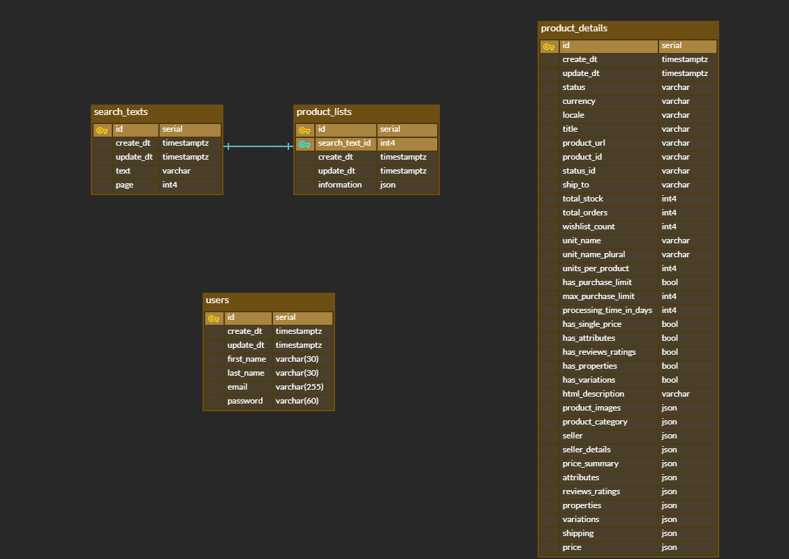

# Ali Express Dropshipping service (AED)

:page_facing_up: Personal project / :date: 2021.7 - 2021.11

Ali Express에서 제공하는 상품 정보를 Zapiex API를 통해 가져와 DB에 저장하고, 사용자들이 drop shipping할 상품들을 검색할 수 있는 기능을 제공하는 서비스입니다.

​    

> :bulb: What is Zapiex API?
>
> *Zapiex API is an unofficial AliExpress API that provides the following **realtime** services on AliExpress*
>
> \- [Zapiex docs](https://docs.zapiex.com/v3/)

​    

## :bookmark: Demo link

* Frontend: [https://aed-frontend-app.herokuapp.com](https://aed-frontend-app.herokuapp.com/)

* Backend: https://aed-backend-app.herokuapp.com/docs

​    

## :bookmark: Tech stack

### Backend

* Python 3.9
* FastAPI 0.68
* PostgreSQL 13
* Alembic 1.7
* Heroku 

### Frontend

* JavaScript
* TypeScript
* React 17.0
* Next.js 11.1
* Bootstrap
* Heroku

​    

## :bookmark: ERD

* `search_texts`

  * 같은 검색어도 페이지가 다르면 구별하여 저장합니다. (Zapiex API 호출 시 검색어와 페이지 인자를 동시에 요구하므로)

    Ex. ('welsh corgi', 1 page) != ('welsh corgi', 5 page)

* `product_lists`
  * `search_text_id`를 Foreign key로 사용하여, `search_texts` 테이블과 1-to-1 realationship을 구축합니다.
* 모든 table은 3NF 정규화를 충족합니다.

​    

## :bookmark: Core features - Backend

### :paperclip: API

#### 1. Product 관련 APIs (products.py)

Zapiex API를 사용해 Ali-Express의 상품 정보를 조회해오는 API 구현 (2개)

검색어 자동완성 API 구현 (1개)

- `search_items_by_text` :pushpin: [코드 확인](https://github.com/veluminous/Ali_Express_Dropshipping/blob/3157387e66446b25b7e288149395ef3fc69ef8e3/backend/app/routers/products.py#L21)
  
  - 검색어와 페이지를 query로 받아 Zapiex API를 호출하고, Ali-Express에서 해당하는 상품 리스트 정보를 조회해주는 API입니다.
  - Zapiex API에 call 개수 제한이 있어, 최대한 호출 수를 줄이는 방향으로 구현했습니다.
    - 처음 검색시 API를 call하여 검색어 및 페이지에 해당하는 상품 리스트 정보를 받고 DB에 저장
    - 이후, update date를 확인하여 하루가 안지났다면 DB의 기존 data를 리턴
    - 하루가 지났다면 새로 API call하여 DB를 update하고 리턴
  - Zapiex API에 page를 query로 보낼 수 있어, pagination 기능을 활용하는 방향으로 구현했습니다.
  
- `create_details` :pushpin: [코드 확인](https://github.com/veluminous/Ali_Express_Dropshipping/blob/3157387e66446b25b7e288149395ef3fc69ef8e3/backend/app/routers/products.py#L70)
  
  - 상품의 id를 query로 받아 Zapiex API를 호출하고, 특정 상품의 detail 정보를 조회하는 API입니다.

  - Zapiex API에는 call 개수 제한이 있어, 최대한 호출 수를 줄이는 방향으로 구현했습니다. (`search_items_by_text`와 동일 방식)
  
  - 응답 코드가 200일 때, 응답 정보 중 'status'가 active한 상품일 때 DB에 저장했습니다.
  
  - Zapiex API에서 입력될 수 있는 id의 유형에 따라 예외처리를 진행했습니다.
  
    * 비정상적인 id를 던질 때, 응답 코드가 201이어서 함수를 그대로 종료
  
      Ex. '1230192314802471024333333333332433256164', 'asdf5625435', ';;;;'
  
    * 한국어를 id로 던지는 등 이외의 상황에서는 해당 에러를 그대로 예외 처리
  
      Ex. '강아지'
  
- `autocomplete_search_text` :pushpin: [코드 확인](https://github.com/veluminous/Ali_Express_Dropshipping/blob/3157387e66446b25b7e288149395ef3fc69ef8e3/backend/app/routers/products.py#L56)
  
  - 검색어 자동완성 API입니다.
  - 프론트에서 검색어 텍스트가 입력될 때마다 API가 호출됩니다.
  - DB에서 저장된 검색어 중 해당 텍스트가 포함된 모든 검색어를 조회해 리턴합니다.
  - 검색어 텍스트는 영어 및 숫자만 입력받을 수 있게 parameter에서 validation합니다.

​    

#### 2. 유저 CRUD관련 APIs (accounts.py)

User 정보에 대한 CRUD API 구현 

- `create_me` :pushpin: [코드 확인](https://github.com/veluminous/Ali_Express_Dropshipping/blob/3157387e66446b25b7e288149395ef3fc69ef8e3/backend/app/routers/accounts.py#L15)
  - 유저 정보를 입력 받아 새로운 유저를 DB에 생성하고 리턴합니다.
  - 패스워드는 `passlib` 라이브러리로 bcrypt 알고리즘을 사용해 해시하여 저장합니다.
  - DB에 유저 존재 유무는 이메일을 활용해 확인합니다.

- `read_me` :pushpin: [코드 확인](https://github.com/veluminous/Ali_Express_Dropshipping/blob/3157387e66446b25b7e288149395ef3fc69ef8e3/backend/app/routers/accounts.py#L25)
  - `get_current_user` dependency를 사용해 현재 유저 정보를 DB에서 조회하고 리턴합니다.
- `update_me` :pushpin: [코드 확인](https://github.com/veluminous/Ali_Express_Dropshipping/blob/3157387e66446b25b7e288149395ef3fc69ef8e3/backend/app/routers/accounts.py#L30)
  - `get_current_user` dependency를 사용해 현재 유저 정보를 DB에서 조회하고, 입력된 사용자 정보를 DB에서 수정하여 리턴합니다.
  - 사용자 정보는 Patch method로 전달합니다. (Partial update합니다.)
  - 다만, 이메일은 수정할 수 없습니다.

- `delete_me` :pushpin: [코드 확인](https://github.com/veluminous/Ali_Express_Dropshipping/blob/3157387e66446b25b7e288149395ef3fc69ef8e3/backend/app/routers/accounts.py#L39)
  - `get_current_user` dependency를 사용해 현재 유저 정보를 DB에서 조회하고 삭제합니다.

​    

#### 3. 인증 및 인가 관련 APIs (authentication.py)

JWT Athentication 및 Authorization API 구현

* `login_for_access_token` :pushpin: [코드 확인](https://github.com/veluminous/Ali_Express_Dropshipping/blob/3157387e66446b25b7e288149395ef3fc69ef8e3/backend/app/routers/authentication.py#L21)
  * 로그인을 통해 authentication을 진행하여 인증된 사용자라면 JWT token을 발급해주는 API입니다.
  * 발급된 JWT는 프론트 측에서 쿠키로 저장됩니다.
  * 프론트 측에서도 만료 날짜(1 day)를 동일하게 설정해, 토큰의 만료와 브라우저에서 토큰이 자동으로 제거되는 것이 동시에 이뤄지게 했습니다.

* `verify_access_token` :pushpin: [코드 확인](https://github.com/veluminous/Ali_Express_Dropshipping/blob/3157387e66446b25b7e288149395ef3fc69ef8e3/backend/app/routers/authentication.py#L44)
  * 유효한 token인지 authorization해주는 API입니다.
  * 프론트에서 특정 페이지 접근을 회원만 할 수 있도록 제한하기 위해 만들었습니다.

​    

### :paperclip: Dependency

* `get_current_user` :pushpin: [코드 확인](https://github.com/veluminous/Ali_Express_Dropshipping/blob/3157387e66446b25b7e288149395ef3fc69ef8e3/backend/app/dependencies.py#L26)
  * HTTP header로 JWT 토큰을 전달 받으면 token을 decoding해 검증하고, 현재 사용자의 DB 존재 유무 및 정보를 리턴합니다.
  * `creat_me`, `login_for_access_token`을 제외한 모든 API를 authorization하는데 사용합니다.

* `get_db` :pushpin: [코드 확인](https://github.com/veluminous/Ali_Express_Dropshipping/blob/3157387e66446b25b7e288149395ef3fc69ef8e3/backend/app/dependencies.py#L18)
  * DB session을 열어 DB 작업이 필요한 API에 잠시 넘겨주고, 작업이 끝나면 다시 session을 돌려받아 닫습니다.

​    

### :paperclip: ETC

* Zapiex API는 클래스로 만들어 사용했습니다. :pushpin: [코드 확인](https://github.com/veluminous/Ali_Express_Dropshipping/blob/3157387e66446b25b7e288149395ef3fc69ef8e3/backend/app/utils/zapiex.py#L6)
* 보안이 필요한 정보는 환경변수에 저장해 사용했습니다. (API key, JWT secret key, DB information...) :pushpin: [코드 확인](https://github.com/veluminous/Ali_Express_Dropshipping/blob/3157387e66446b25b7e288149395ef3fc69ef8e3/backend/app/settings.py#L4)
* CORS 문제는 미들웨어(Middleware)를 이용해 허용했습니다. :pushpin: [코드 확인](https://github.com/veluminous/Ali_Express_Dropshipping/blob/3157387e66446b25b7e288149395ef3fc69ef8e3/backend/app/main.py#L15)

​    

## :bookmark: Trouble shooting - Backend

* 특정 상황을 Alembic autogeneration이 잘 감지하지 못하는 문제 :pushpin: [코드 확인](https://github.com/veluminous/Ali_Express_Dropshipping/blob/3157387e66446b25b7e288149395ef3fc69ef8e3/backend/alembic/env.py#L54)
  * Column의 타입 변화 같은 alter 관련 테이블 변화가 autogeneration 시 잘 반영되지 않았습니다.
  * `run_migrations_offline` 및 `run_migrations_online`에 `compare_type=True`를 설정해서 해결 

* Zapiex API 호출 시 상품 정보 리스트의 갯수가 균일하게 오지 않는 현상 :pushpin: [코드 확인](https://github.com/veluminous/Ali_Express_Dropshipping/blob/06385b224bf2af0b28161494a96138eea0505ed5/frontend/pages/products.tsx#L67)
  * 20개의 상품에 대한 정보 리스트가  와야하는데, 약 15~18개가 무작위로 오는 현상이 발생했습니다.
  * API document에서 AliExpress-promoted products는 규격이 맞지 않아 제외하고 보내진다는 점을 확인했습니다.
  * 프론트 측에서 몇몇 아이템이 제외되더라도 안전하게 12개씩 pagination하는 방식으로 해결했습니다. 

* Product detail 관련 Zapiex API를 호출할 시 input으로 사용되는 id의 종류에 따라 다른 상태코드 응답 :pushpin: [코드 확인](https://github.com/veluminous/Ali_Express_Dropshipping/blob/3157387e66446b25b7e288149395ef3fc69ef8e3/backend/app/routers/products.py#L94)
  * 비정상적인 input이 될 수 있는 경우를 시도해보면서 경우의 수를 나누며 해결했습니다. 

* `datetime` 객체 비교 에러 (`search_items_by_text`, `create_details` API) :pushpin: [코드 확인](https://github.com/veluminous/Ali_Express_Dropshipping/blob/06385b224bf2af0b28161494a96138eea0505ed5/backend/app/routers/products.py#L27)
  * update date를 비교할 때, `TypeError: can't compare offset-naive and offset-aware datetimes` 발생했습니다.
  * 시간대가 포함된 aware 타입 datetime 객체(DB의 date)와 그렇지 않은 naive 타입 datetime 객체(새로 만든 date) 간 비교로 인한 문제였습니다.
  * `pytz` 라이브러리를 사용해 naive 타입 객체를 aware 타입으로 바꿔서 해결했습니다. 

* `fastapi_pagination` 외부 라이브러리 적용 시 서버 배포 에러 :pushpin: [코드 확인](https://github.com/veluminous/Ali_Express_Dropshipping/blob/06385b224bf2af0b28161494a96138eea0505ed5/backend/app/crud/crud_product.py#L39)
  * 원래 검색어 자동 완성 API에는 `fastapi_pagination` 라이브러리를 적용해 pagination을 구현했습니다.
  * 다만, Heroku 서버 배포 시 `TypeError: typing.ClassVar...`가 발생했습니다.
  * `fastapi_pagination`을 적용할 때 FastApi app 인스턴스를 감싸 nested 되는 부분이 존재하는데, 라이브러리의 기본 사용법에 해당하는 부분이라 라이브러리에 문제가 있다고 판단했습니다.
  * 라이브러리 적용을 해제하는 방향으로 해결했습니다. 

​    

## :bookmark: Features - Frontend

- 페이지가 변화해도 Header, Footer 컴포넌트는 유지되는 SPA(Single Page Application) 형태로 제작했습니다.
- 회원 가입, 로그인, 서비스 소개, 상품 리스트, 특정 상품 정보 페이지를 구현했습니다.  :pushpin: [코드 확인](https://github.com/veluminous/Ali_Express_Dropshipping/tree/master/frontend/pages)
- Product detail 페이지는 모든 페이지를 미리 생성해둘 수 없으므로 서버 사이드 랜더링(Server-side rendering)으로 구현하고, 그 외의 페이지는 클라이언트 사이드 랜더링(Client-side rendering)으로 구현했습니다.  :pushpin: [코드 확인](https://github.com/veluminous/Ali_Express_Dropshipping/blob/6714a11f64eaa8d5b060fb31c71782892958c6b4/frontend/pages/product/%5Bproduct_id%5D.tsx#L160)
- 특정 페이지는 로그인을 했을 경우에만 접근 가능하도록 구현했습니다.  :pushpin: [코드 예시 확인](https://github.com/veluminous/Ali_Express_Dropshipping/blob/6714a11f64eaa8d5b060fb31c71782892958c6b4/frontend/pages/product/%5Bproduct_id%5D.tsx#L179)
- 검색어를 입력할 때마다 API 호출로 자동 완성되도록 `Autocomplete` 컴포넌트를 구현했습니다.  :pushpin: [코드 확인](https://github.com/veluminous/Ali_Express_Dropshipping/blob/06385b224bf2af0b28161494a96138eea0505ed5/frontend/src/components/autocomplete.tsx#L5)
- 상품 리스트 페이지에 pagination 기능을 부여하는 `Pagination` 컴포넌트를 구현했습니다.  :pushpin: [코드 확인](https://github.com/veluminous/Ali_Express_Dropshipping/blob/06385b224bf2af0b28161494a96138eea0505ed5/frontend/src/components/pagination.tsx#L6)
- Bootstrap으로 디자인을 적용했습니다.

​    
